# Architecture Document

This document provides system architecture diagrams for all 10 features using Mermaid notation. Diagrams are designed to be readable by both humans and AI agents.

---

## System Overview

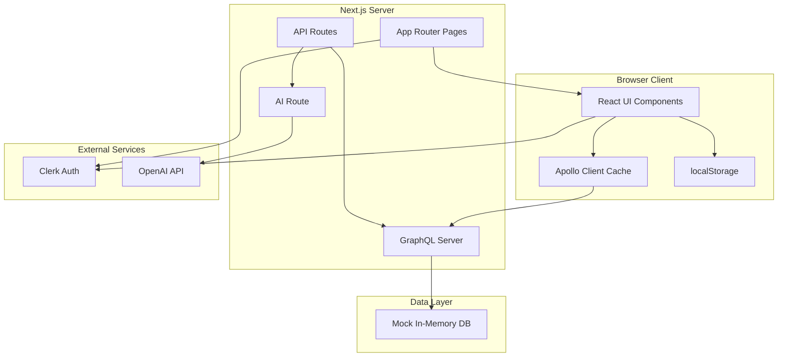

---

## Feature Architecture Diagrams

### F1: Dashboard Reordering

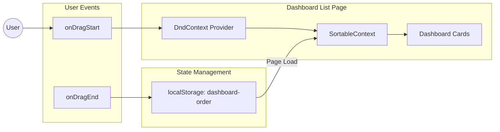

**Data Flow**:
1. User drags dashboard card
2. DndContext captures drag events
3. SortableContext updates visual order
4. onDragEnd saves order to localStorage
5. Page load reads order from localStorage and applies

---

### F2: Styling System

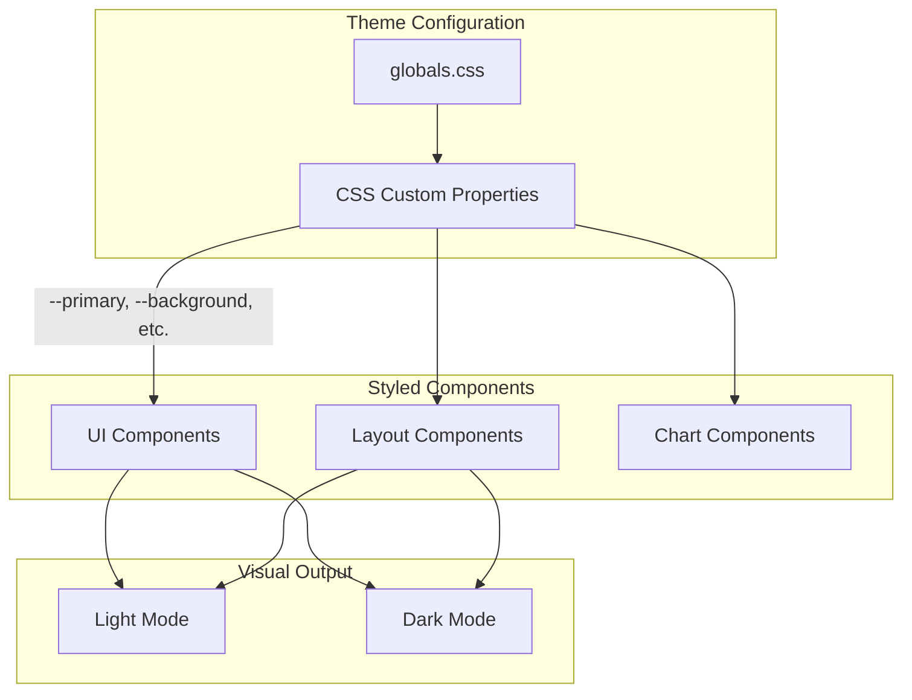

**CSS Variable Categories**:
- Colors: `--primary`, `--background`, `--foreground`, `--accent`
- Spacing: `--radius`, `--radius-sm`, `--radius-lg`
- Effects: shadows, gradients, glass effects

---

### F3: SQL Line Wrapping

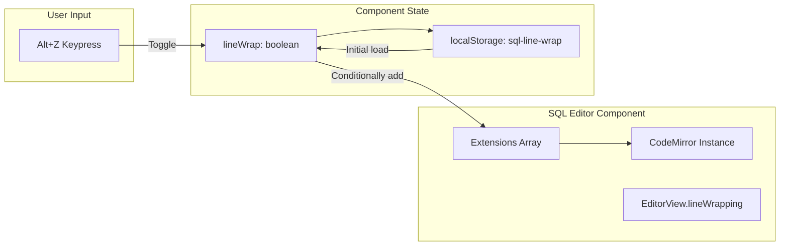

**Toggle Logic**:
```
if (lineWrap) {
  extensions.push(EditorView.lineWrapping)
}
```

---

### F4: Table Chart Sorting

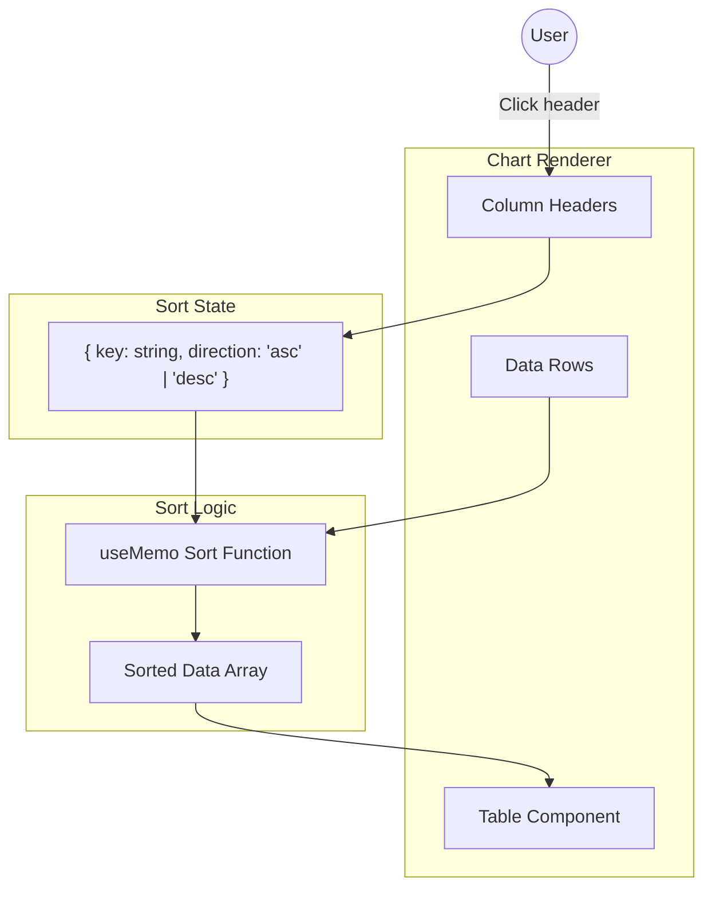

**Sort Cycle**: none → asc → desc → none

---

### F5: Table Column Reordering

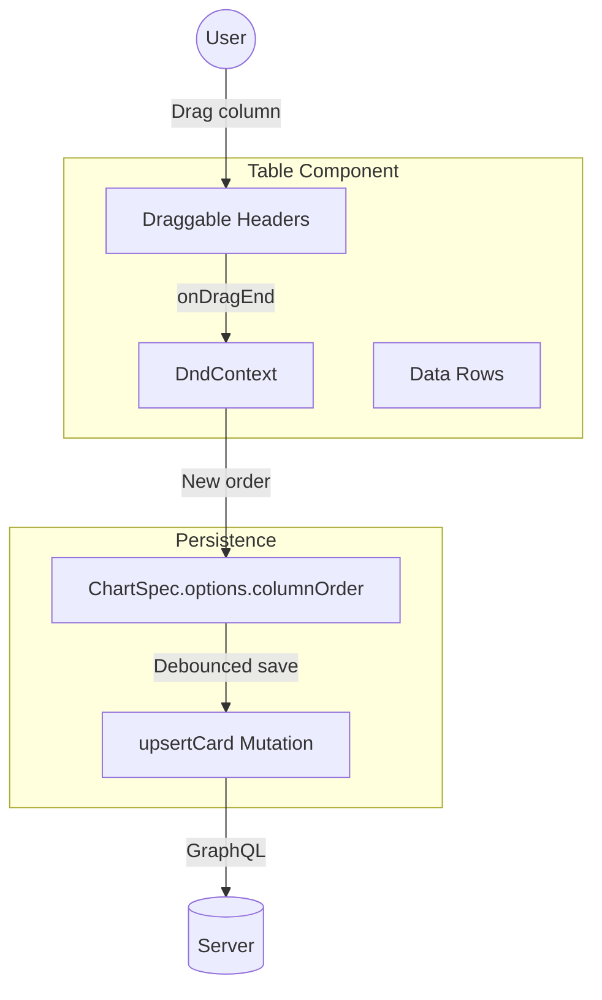

---

### F6: Loading Spinner

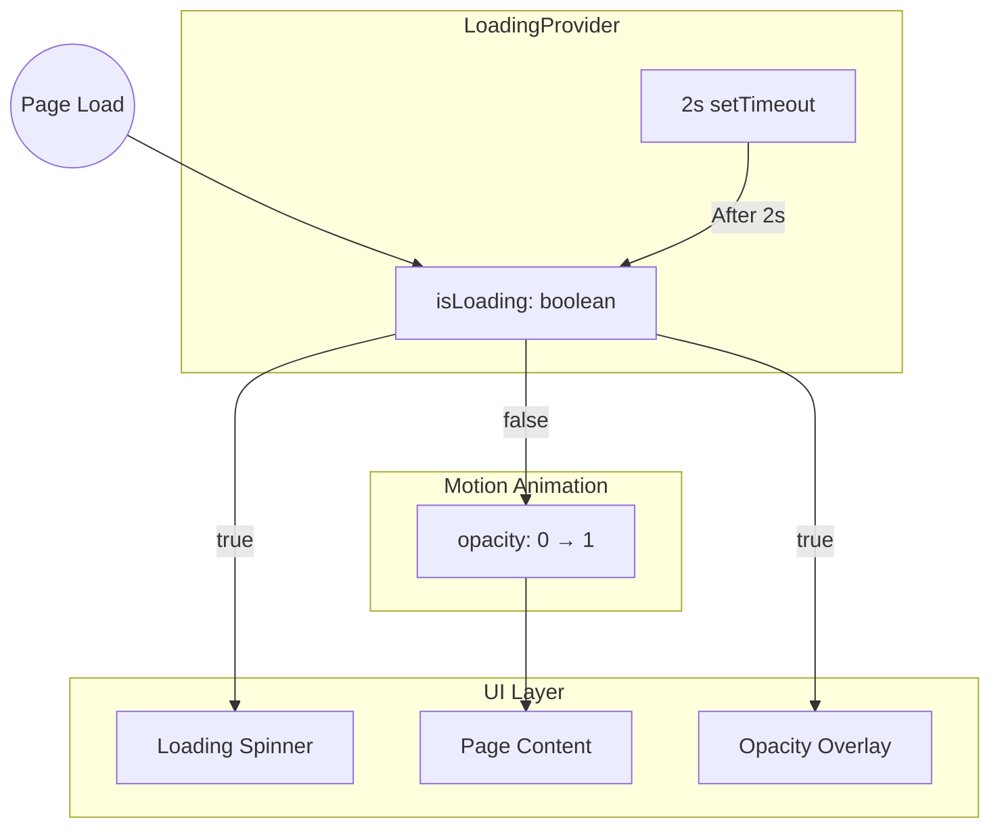

**Flow**:
1. Page loads → isLoading = true
2. Spinner displays, content hidden (opacity: 0)
3. 2 second timer completes
4. isLoading = false
5. Content fades in over 500ms

---

### F7: Security Flow

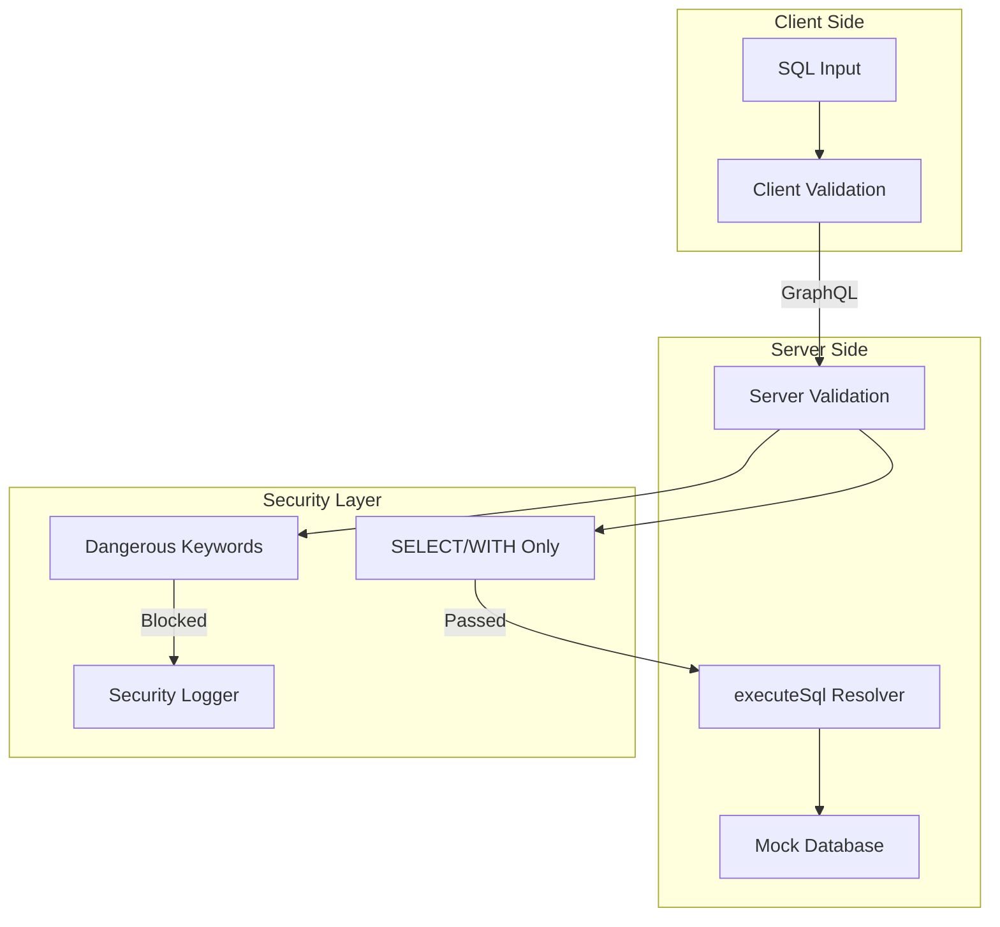

**Validation Chain**:
1. Client validates (UX - immediate feedback)
2. Server validates (Security - cannot be bypassed)
3. Both use same rules (consistency)

---

### F8: AI SQL Agent

```mermaid
flowchart TB
    subgraph Explorer["Data Explorer Page"]
        NLInput[Natural Language Input]
        GenerateBtn[Generate SQL Button]
        SQLEditor[SQL Editor]
    end

    subgraph API["API Layer"]
        AIRoute[/api/ai/generate-sql]
        SchemaContext[Schema Metadata]
    end

    subgraph AI["AI Processing"]
        OpenAI[OpenAI GPT-4]
        Fallback[Keyword Fallback]
    end

    subgraph Output["Result"]
        GeneratedSQL[Generated SQL]
        ExecuteBtn[Execute Button]
    end

    User((User)) --> NLInput
    NLInput --> GenerateBtn
    GenerateBtn --> AIRoute
    SchemaContext --> AIRoute
    AIRoute --> |"API Key exists"| OpenAI
    AIRoute --> |"No API Key"| Fallback
    OpenAI --> GeneratedSQL
    Fallback --> |"+ Warning message"| GeneratedSQL
    GeneratedSQL --> SQLEditor
    SQLEditor --> ExecuteBtn
```

**Fallback Keywords**:
- "customer" → `SELECT * FROM customers`
- "revenue" → `SELECT * FROM revenue_summary`
- "deal" → `SELECT * FROM deals`

---

### F9: Scatter Plot

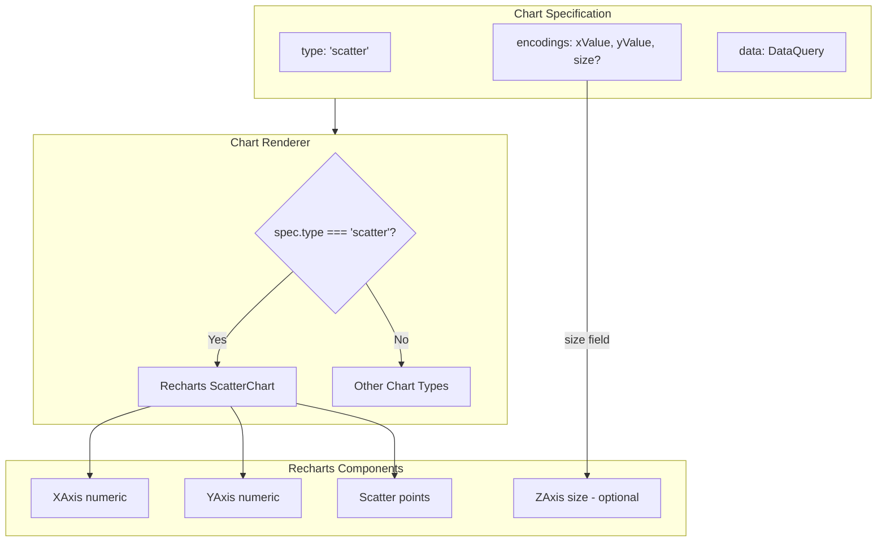

---

### F10: Dashboard Folders

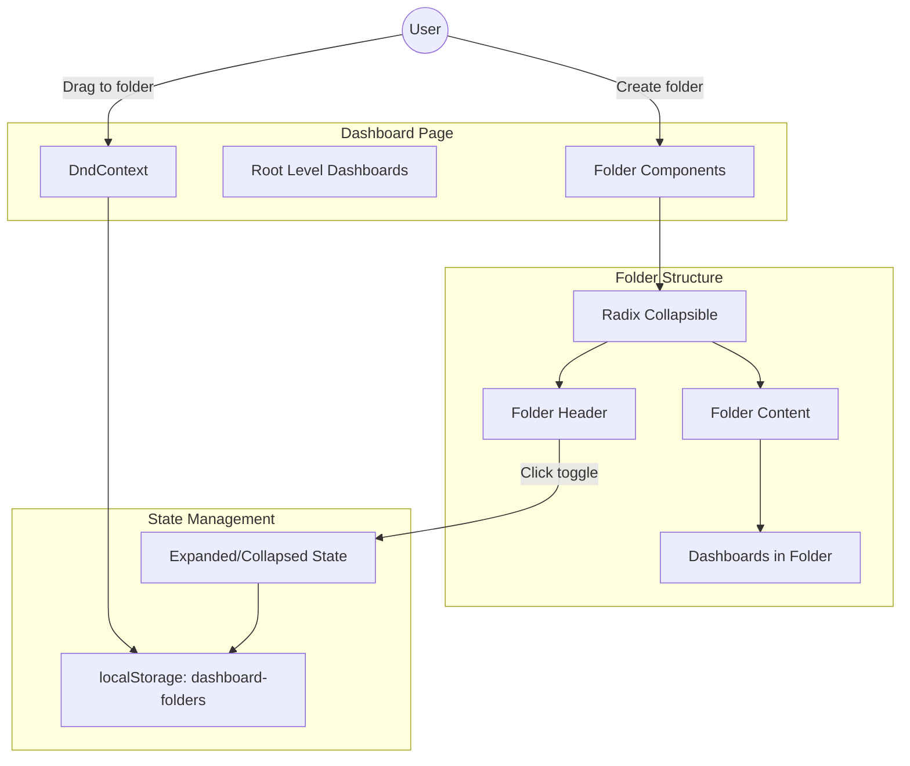

**Folder Data Structure**:
```typescript
interface FolderState {
  folders: {
    id: string
    name: string
    dashboardIds: string[]
    isExpanded: boolean
  }[]
  rootDashboardIds: string[]  // Dashboards not in any folder
}
```

---

## Complete User Flow

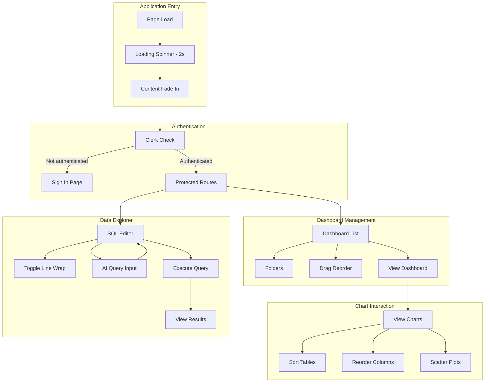

---

## State Management Overview

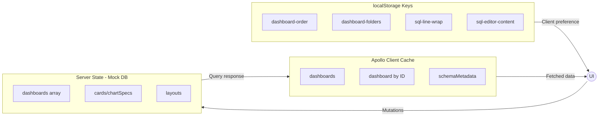

---

## File Dependency Graph

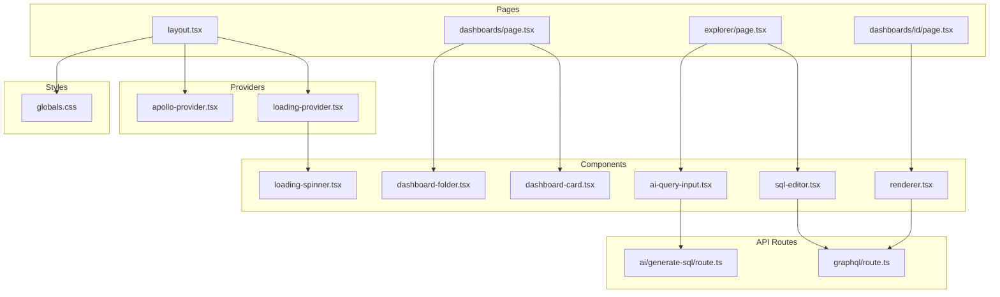

---

*End of Architecture Document*
